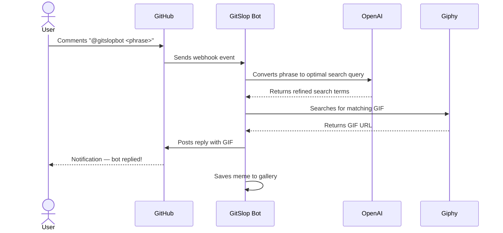

# GitSlop 🤖

> A GitHub App that replies to `@gitslopbot` mentions with AI-matched reaction GIFs — because every bug deserves a meme.

**🌐 Live gallery:** [codes-son.github.io/gitslop](https://codes-son.github.io/gitslop/)  
**📦 Install the bot:** [github.com/apps/gitslopbot](https://github.com/apps/gitslopbot)  
**🛝 Try the playground:** [gitslop/issues/1](https://github.com/codes-son/gitslop/issues/1)

---

## Quick Start

### 1. Install the App

Click **[Install GitSlop](https://github.com/apps/gitslopbot)** and grant access to the repositories where you want the bot to be active.

### 2. Mention the Bot

In any issue, pull request, or discussion comment, mention `@gitslopbot` followed by a keyword or phrase:

```
@gitslopbot this PR is a disaster
```

```
@gitslopbot ship it
```

```
@gitslopbot fixing bugs on a Friday
```

### 3. Get a GIF

The bot automatically replies with a context-aware reaction GIF sourced from Giphy. No configuration needed.

---

## How It Works



---

## Gallery

Every GIF the bot posts is automatically added to the public gallery at [codes-son.github.io/gitslop](https://codes-son.github.io/gitslop/). Browse the full history of generated memes and see what others have triggered.

---

## Permissions Required

When installing the app, GitSlop requests the following permissions:

| Permission | Access | Reason |
|---|---|---|
| Issues | Read & Write | Read comments, post GIF replies |
| Pull Requests | Read & Write | Read comments, post GIF replies |
| Discussions | Read & Write | Read comments, post GIF replies |

GitSlop does **not** access your code, secrets, or any repository data beyond comments.

---

## Stack

| Layer | Technology |
|---|---|
| Backend | Node.js · Express · GitHub App Auth |
| AI | OpenAI GPT-4o-mini (query refinement) |
| GIF Source | Giphy API |
| Frontend | React · Vite · TanStack Query |
| Database | PostgreSQL (meme gallery) |
| Hosting | Replit (API) · GitHub Pages (frontend) |

---

## Self-Hosting

### Environment Variables

| Variable | Description |
|---|---|
| `GITHUB_APP_ID` | Your GitHub App ID |
| `GITHUB_APP_PRIVATE_KEY` | GitHub App private key (PEM format, newlines as `\n`) |
| `GITHUB_WEBHOOK_SECRET` | Webhook secret configured in your GitHub App |
| `GIPHY_API_KEY` | Giphy API key |
| `OPENAI_API_KEY` | OpenAI API key |
| `DATABASE_URL` | PostgreSQL connection string |

### Local Development

```bash
pnpm install
pnpm run dev
```

Push database schema:

```bash
pnpm --filter @workspace/db run push
```

### GitHub App Setup

1. Go to [github.com/settings/apps/new](https://github.com/settings/apps/new)
2. Set **Webhook URL** to `https://<your-domain>/api/webhook/github`
3. Set **Webhook Secret** and save the same value as `GITHUB_WEBHOOK_SECRET`
4. Grant **Read & Write** on Issues, Pull Requests, and Discussions
5. Subscribe to events: **Issue comment**, **Pull request review comment**, **Discussion comment**
6. Generate and download a **Private Key**, then set it as `GITHUB_APP_PRIVATE_KEY`
7. Install the app on your repositories

---

## License

MIT
